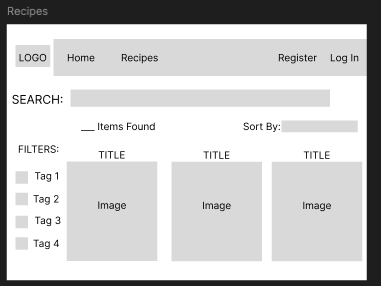
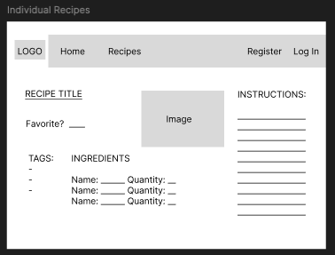

The content below is an example project proposal / requirements document. Replace the text below the lines marked "__TODO__" with details specific to your project. Remove the "TODO" lines.

# Recipe Sharing Platform

## Overview

This platform allows users to create, share, and discover recipes. Each recipe includes a list of ingredients, preparation instructions, and optional images. Users can also search by ingredients, dietary restrictions, or cuisine type, and save favorite recipes to their profile.

## Data Model

The application will store Users, Recipes, and potentially Comments/Ratings (if implemented).

- **Users** can have multiple **Recipes** (via references).
- Each **Recipe** will include embedded **Ingredients** and possibly **Comments** if users can provide feedback on recipes.

### Sample Documents

Example User:

```javascript
{
  username: "chefmaster",
  hash: // a password hash,
  favorites: // array of references to Recipe documents,
  recipes: // array of references to Recipe documents
}
```

Example Recipe:

```javascript
{
  author: // reference to a User object,
  title: "Ugali",
  ingredients: [
    { name: "cornmeal", quantity: "1 cups" },
    { name: "water", quantity: "1 cups" },
    { name: "butter", quantity: "1/4 stick" }
  ],
  instructions: "Mix ingredients and boil in pot on medium heat...",
  tags: ["lunch", "vegetarian"],
  createdAt: // timestamp,
  comments: [
    { user: // reference from a user, or maybe text: "Loved it!"
    createdAt: // time here 
    }
  ]
}
```

## [Link to Commented First Draft Schema](db.js)

## Wireframes

1. **/recipes/create** - creating a new recipe
   
   
2. **/recipes** - show/search recipes with filters
   
   
3. **/recipes/:slug** - display a single recipe with details, tags, and comments
   

## Site Map

- **Home** -> / (displays latest/featured recipes)
- **All Recipes** -> /recipes
  - **Individual Recipe** -> /recipes/:slug
  - **Create Recipe** -> /recipes/create
- **User Profile** -> /user/:username

## User Stories or Use Cases

1. As a 'not yet registered' user, I can register a new account on the site.
2. As a registered user, I can log in to the site.
3. As a user, I can create/add a new recipe.
4. As a user, I can put in comments on recipes to share my feedback.
5. As a user, I can look at or search for recipes with the option to filter by ingredients or dietary tags.
6. As a user, I can list recipes to my 'favorites' section.

## Research Topics

* (3 points) Unit Testing with JavaScript
   * I want to use Jest to write at least four unit tests that verify core functionality. Maybe I'll do route responses and recipe data handling.
   * I plan on linking the tests in the repository and include a screenshot of successful test runs.
  
* (5 points) Automated Functional Testing for Routes
   * I think I'll try to use Headless Chrome for automated testing of key routes. Maybe I'll do  viewing, creating, editing, and/or deleting a recipe.
   * At least of four tests will be written, with links to the test code in the repository with screenshots, as mentioned earlier.
  
* (2 points) CSS Framework or UI Toolkit
   * I think I'll go for Tailwind CSS to style the application. I'll get to customizing to hopefully achieve a consistent theme across pages.
   * All the relevant code and customizations should be in the repository too.

10 points total out of 8 required points

## [Link to Initial Main Project File](app.mjs)

## Annotations / References Used

1. [MongoDB Atlas Configure IP](https://www.mongodb.com/docs/atlas/security/ip-access-list/#add-ip-access-list-entries) - (for whitelisting Courant's IP Address)
2. [Github Managing Access Tokens](https://docs.github.com/en/authentication/keeping-your-account-and-data-secure/managing-your-personal-access-tokens#creating-a-personal-access-token-classic) - (for setting up the access tokens before deploying to Courant's server)
3. [Tailwind Setup](https://tailwindcss.com/docs/content-configuration) - (for getting the Tailwind CSS configuration set and output file)
4. [Configuration of the Database](https://stackoverflow.com/questions/55267494/the-uri-parameter-to-openuri-must-be-a-string-got-undefined) - (I used this resource in HW5 too, but I used some assistance in path, url, and getting the URI parameter correct)
5. [Handlebars Basics](https://handlebarsjs.com/guide/#simple-expressions) - (I used this resource to make sure my form outline functioned well)
6. [Form and Post Handling](https://stackoverflow.com/questions/58566856/res-status-500-message-internal-server-error-find-product-by-name-and-price) - (This resource helped with the async, the error handling, and status change)
7. [Mongoose Connection](https://mongoosejs.com/docs/connections.html) - (This source helped with Mongoose connection and DSN printing)